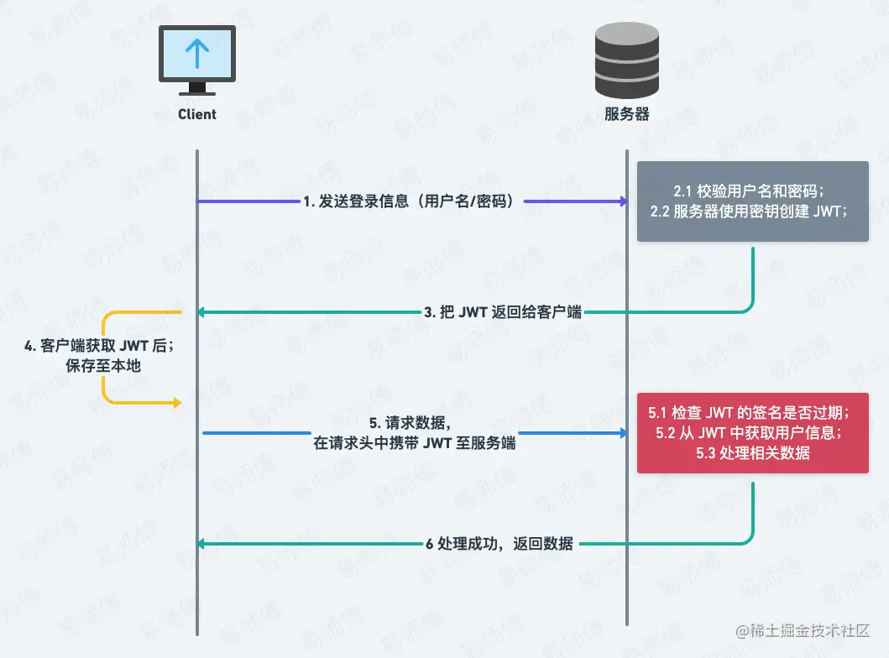
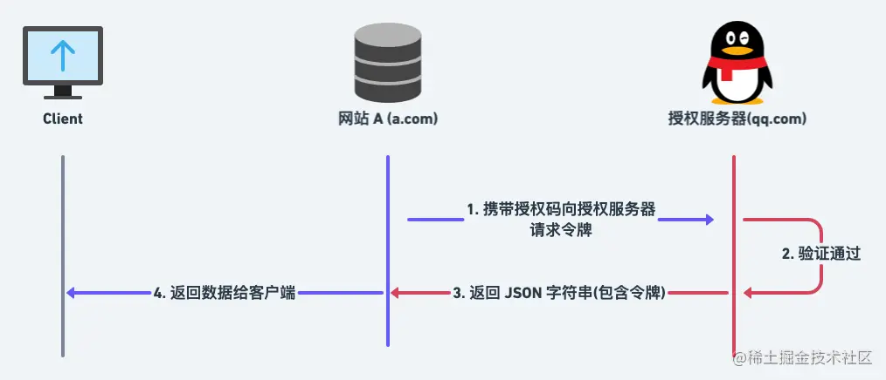

RePost from :

[一文教你搞定所有前端鉴权与后端鉴权方案，让你不再迷惘 - 掘金 (juejin.cn)](https://juejin.cn/post/7129298214959710244#heading-25)


## Terminology


* **认证(Identification)** ：根据声明者所特有的识别信息，确认声明者的身份。
  身份证，用户名和密码等

* **授权(Authorization)**： 在信息安全领域是指资源所有者委派执行者，赋予执行者指定范围的资源操作权限，以便对资源的相关操作。

  现实生活领域： 银行卡（由银行派发）、门禁卡（由物业管理处派发）、钥匙（由房东派发）

  互联网领域： web 服务器的 session 机制、web 浏览器的 cookie 机制、颁发授权令牌（token）等

* **鉴权(Authentication)**： 在信息安全领域是指对于一个声明者所声明的身份权利，对其所声明的真实性进行**鉴别确认**的过程。授权和鉴权是两个上下游相匹配的关系，先授权，后鉴权。

  现实生活领域： 门禁卡需要通过门禁卡识别器，银行卡需要通过银行卡识别器；

  互联网领域： 校验 session/cookie/token 的合法性和有效性

* **权限控制(Access/Permission Control)**： 将可执行的操作定义为权限列表，然后判断操作是否允许/禁止
  对于权限控制，可以分为两部分进行理解：一个是权限，另一个是控制。权限是抽象的逻辑概念，而控制是具体的实现方式。

  现实生活领域： 门禁卡的权限

  互联网领域： 通过 web 后端服务，控制接口访问，允许或拒绝访问请求

## 关系

前后依次发生


使用门禁卡开门： 认证、授权、鉴权、权限控制四个环节一气呵成，在瞬间同时发生

用户的网站登录： 用户在使用用户名和密码进行登录时，认证和授权两个环节一同完成，而鉴权和权限控制则发生在后续的请求访问中，比如在选购物品或支付时。

## HTTP基本鉴权

在 HTTP 中，`基本认证方案（Basic Access Authentication)` 是允许客户端（通常指的就是网页浏览器）在请求时，通过用户提供用户名和密码的方式，实现对用户身份的验证。

> 几乎所有网站都不会使用此认证方案


### 缺点

* 不安全
* 无法主动注销

##  Session-Cookie 鉴权

`Session-Cookie` 认证是利用**服务端**的 Session和 **客户端** 的 Cookie 来实现的前后端通信认证模式。

### Cookie

`HTTP` 无状态（对于事务处理没有记忆能力，每次客户端和服务端会话完成时，服务端不会保存任何会话信息）

为了**让服务器区分不同的客户端**，服务端就必须主动的去维护一个状态，这个状态用于告知服务端前后两个请求是否来自同一浏览器。而这个状态可以通过 `Cookie` 去实现。

**特点：**

- 存储在客户端，可随意篡改，不安全
- 有大小限制，最大为 4kb
- 有数量限制，一般一个浏览器对于一个网站只能存不超过 20 个 Cookie，浏览器一般只允许存放 300个 Cookie
- Android 和 IOS 对 Cookie 支持性不好
- 不可跨域

### Session

无状态协议通信过程中，为了实现中断/继续操作，将用户和服务器之间的交互进行的一种抽象；

具体来说，是服务器生成的一种具有特定结构的数据，可以通过多种方式保存，如内存、数据库、文件等，大型网站一般有专门的 Session 服务器集群来保存用户会话

**原理流程：**

1. **客户端：** 用户向服务器首次发送请求；
2. **服务器：** 接收到数据并自动为该用户创建特定的 Session / Session ID，来标识用户并跟踪用户当前的会话过程；
3. **客户端：** 浏览器收到响应获取会话信息，并且会在下一次请求时带上 Session / Session ID；
4. **服务器：** 服务器提取后会与本地保存的 Session ID进行对比找到该特定用户的会话，进而获取会话状态；
5. 至此客户端与服务器的通信变成有状态的通信；

**特点：**

- Session 保存在服务器上；
- 通过服务器自带的加密协议进行；

**与 Cookie 的差异：**

- **安全性：** Cookie 由于保存在客户端，可随意篡改，Session 则不同存储在服务器端，无法伪造，所以 Session 的安全性更高；
- **存取值的类型不同：** Cookie 只支持字符串数据，Session 可以存任意数据类型；
- **有效期不同：** Cookie 可设置为长时间保持，Session 一般失效时间较短；
- **存储大小不同：** Cookie 保存的数据不能超过 4K；

> `Session-Cookie` ：将 `Session` 存储在客户端的 `Cookie` 中


**Pros**

* Cookie 简单易用
* Session 数据存储在服务端，相较于 JWT 方便进行管理，也就是当用户登录和主动注销，只需要添加删除对应的 Session 就可以了，方便管理
* 只需要后端操作即可，前端可以无感等进行操作

**Cons**

* 依赖 Cookie(用户可能在浏览器端禁用 Cookie）
* 非常不安全，Cookie 将数据暴露在浏览器中，增加了数据被盗的风险（容易被 CSRF 等攻击）
* Session 存储在服务端（Redis），增大了服务端的开销，用户量大的时候会大大降低服务器性能
* 对移动端的支持性不友好

**前端常用库**

- 使用 express：[express-session](https://link.juejin.cn/?target=https%3A%2F%2Fgithub.com%2Fexpressjs%2Fsession)
- 使用 koa：[koa-session](https://link.juejin.cn/?target=https%3A%2F%2Fgithub.com%2Fkoajs%2Fsession)

## Token 鉴权

避免`Session-Cookie` 缺点

### Token

`Token` 是一个令牌，客户端访问服务器时，验证通过后服务端会为其签发一张令牌，之后，客户端就可以携带令牌访问服务器，服务端只需要验证令牌的有效性即可。

即：**访问资源接口（API）时所需要的资源凭证**

一般 Token 的组成：**uid** (用户唯一的身份标识) + **time** (当前时间的时间戳) + **sign** (签名，Token 的前几位以哈希算法压缩成的一定长度的十六进制字符串)


**Pros**

* **服务端无状态化、可扩展性好：** Token 机制在服务端不需要存储会话（Session）信息，因为 Token 自身包含了其所标识用户的相关信息，这有利于在多个服务间共享用户状态
* **支持 APP 移动端设备；**
* **安全性好：** 有效避免 CSRF 攻击（因为不需要 Cookie）
* **支持跨程序调用：** 因为 Cookie 是不允许跨域访问的，而 Token 则不存在这个问题

**Cons**

* **配合：** 需要前后端配合处理；
* **占带宽：** 正常情况下比 `sid` 更大，消耗更多流量，挤占更多宽带
* **性能问题：** 虽说验证 Token 时不用再去访问数据库或远程服务进行权限校验，但是需要对 Token 加解密等操作，所以会更耗性能；
* **有效期短：** 为了避免 Token 被盗用，一般 Token 的有效期会设置的较短，需要 `Refresh Token`

### Refresh Token

业务接口用来鉴权的 Token，称为 `Access Token`。

为了安全， `Access Token` 有效期一般设置较短，以避免被盗用。但过短的有效期会造成 `Access Token` 经常过期

解决办法：

* 刷新 `Access Token`，让用户重新登录获取新 Token，会很麻烦；
* 引入一个专门生成 Access Token 的 Token，称为 `Refresh Token`

**区别**

- **Access Token：** 用来访问业务接口，由于有效期足够短，盗用风险小，也可以使请求方式更宽松灵活；
- **Refresh Token：** 用来获取 Access Token，有效期可以长一些，通过独立服务和严格的请求方式增加安全性；由于不常验证，也可以如前面的 Session 一样处理；


### 与 Session-Cookie 的区别

`Session-Cookie` 和 `Token` 有很多类似的地方， `Token` 像是 `Session-Cookie` 的升级改良版，存在以下区别

- **存储地不同：** Session 一般是存储在服务端；Token 是无状态的，一般由前端存储；
- **安全性不同：** Session 和 Token 并不矛盾，作为身份认证 Token 安全性比 Session 好，因为每一个请求都有签名还能防止监听以及重放攻击；
- **支持性不同：** Session-Cookie 认证需要靠浏览器的 Cookie 机制实现，如果遇到原生 NativeAPP 时这种机制就不起作用了，或是浏览器的 Cookie 存储功能被禁用，也是无法使用该认证机制实现鉴权的；而 Token 验证机制丰富了客户端类型。

> **如果用户数据可能需要和第三方共享，或者允许第三方调用 API 接口，则应使用 Token**

##  JWT（JSON Web Token）鉴权

服务端验证客户端发送过来的 Token 时，还需要查询数据库获取用户基本信息，然后验证 Token 是否有效

每次请求验证都要查询数据库，增加了查库带来的延迟等性能消耗；

**业界常用解决方案： `JWT`**

### JWT

`JWT` 是 `Auth0` 提出的通过 `对 JSON 进行加密签名`来实现授权验证的方案

就是登录成功后将相关用户信息组成 JSON 对象，然后对这个对象进行某种方式的`加密`，返回给客户端； 客户端在下次请求时带上这个 Token； 服务端再收到请求时`校验 token 合法性`，其实也就是在校验请求的合法性。

**组成**

它是一个很长的字符串，中间用点（`.`）分隔成三个部分

* `Header`

  通常包括两部分

  * typ：代表 Token 的类型，这里使用的是 JWT 类型；
  * alg：使用的 Hash 算法，例如 HMAC SHA256 或 RSA.

* `Payload`

  包含一些声明 Claim (实体的描述，通常是一个 User 信息，还包括一些其他的元数据) ，用来存放实际需要传递的数据

  JWT 规定了7个官方字段：

  - iss (issuer)：签发人
  - exp (expiration time)：过期时间
  - sub (subject)：主题
  - aud (audience)：受众
  - nbf (Not Before)：生效时间
  - iat (Issued At)：签发时间
  - jti (JWT ID)：编号

  除了官方字段，还可以在这个部分定义私有字段

* `Signature`

  Signature 部分是对前两部分的签名，**防止数据篡改**。

  首先，需要指定一个密钥（secret）。这个密钥只有服务器才知道，不能泄露给用户。然后，使用 Header 里面指定的签名算法（默认是 HMAC SHA256）产生签名。

**使用方式**

客户端收到服务器返回的 JWT，可以储存在 Cookie 里面，也可以储存在 localStorage。

此后，客户端每次与服务器通信，都要带上这个 JWT。

可以把它放在 Cookie 里面自动发送，但是这样不能跨域，所以更好的做法是放在 HTTP 请求的头信息`Authorization`字段里面。

```sql
 Authorization: Bearer <token>
```



**Pros**

* 不需要在服务端保存会话信息（RESTful API 的原则之一就是无状态），所以易于应用的扩展，即信息不保存在服务端，不会存在 Session 扩展不方便的情况
* JWT 中的 Payload 负载可以存储常用信息，用于信息交换，有效地使用 JWT，可以降低服务端查询数据库的次数

**Cons**

* **加密问题：** JWT 默认是不加密，但也是可以加密的。生成原始 Token 以后，可以用密钥再加密一次。
* **到期问题：** 由于服务器不保存 Session 状态，因此无法在使用过程中废止某个 Token，或者更改 Token 的权限。也就是说，一旦 JWT 签发了，在到期之前就会始终有效，除非服务器部署额外的逻辑。

**前端常用库**

- 使用 express：[express-jwt](https://link.juejin.cn/?target=https%3A%2F%2Fgithub.com%2Fauth0%2Fexpress-jwt)
- 使用 koa：[koa-jwt](https://link.juejin.cn/?target=https%3A%2F%2Fgithub.com%2Fkoajs%2Fjwt)

##  单点登录（Single Sign On）

避免大型系统内子系统的重复登录，只需要登录一次，就可以访问其他相互信任的应用系统

例如

- 登录天猫，淘宝也会自动登录；
- 登录百度贴吧，百度网盘也会自动登录；

### 同域SSO

当百度网站存在两个相同主域名下的贴吧子系统 `tieba.baidu.com` 和网盘子系统 `pan.baidu.com` 时，以下为他们实现 SSO 的步骤：

1. **客户端：** 用户访问某个子系统时（例如 `tieba.baidu.com`），如果没有登录，则跳转至 SSO 认证中心提供的登录页面进行登录；
2. **服务端：** 登录认证后，服务端把登录用户的信息存储于 Session 中，并且附加在响应头的 `Set-Cookie` 字段中，设置 Cookie 的 Domain 为 `.baidu.com` ；
3. **客户端**：再次发送请求时，携带主域名 Domain 下的 Cookie 给服务器，此时服务端就可以通过该 Cookie 来验证登录状态了；

亦即  `Session-Cookie 认证` 

### 异域SSO

如天猫 (tmall.com) 和 淘宝 (taobao.com) 

利用 `CAS(Central Authentication Service)`中央授权服务


1. **客户端：** 开始访问系统 A；
2. **系统 A：** 发现用户未登录，重定向至 CAS 认证服务（sso.com），同时 URL 地址参数携带登录成功后回跳到系统 A 的页面链接
3. **CAS 认证服务：** 发现请求 Cookie 中没有携带登录的票据凭证（TGC），所以 CAS 认证服务判定用户处于 `未登录` 状态，重定向用户页面至 CAS 的登录界面，用户在 CAS 的登录页面上进行登录操作。
4. **客户端：** 输入用户名密码进行 CAS 系统认证；
5. **CAS 认证服务：** 校验用户信息，并且 `生成 TGC` 放入自己的 Session 中，同时以 Set-Cookie 形式写入 Domain 为 `sso.com` 的域下 ；同时生成一个 `授权令牌 ST (Service Ticket)` ，然后重定向至系统 A 的地址，重定向的地址中包含生成的 ST
6. **系统 A：** 拿着 ST 向 CAS 认证服务发送请求，CAS 认证服务验证票据 (ST) 的有效性。验证成功后，系统 A 知道用户已经在 CAS 登录了（其中的 ST 可以保存到 Cookie 或者本地中），系统 A 服务器使用该票据 (ST) 创建与用户的会话，称为局部会话，返回受保护资源；

7. **客户端：** 开始访问系统 B；
8. **系统 B：** 发现用户未登录，重定向至 SSO 认证服务，并将自己的地址作为参数传递，并附上在 sso.com 域下的 cookie 值是第五步生成的 TGC；
9. **CAS 认证服务：** CAS 认证服务中心发现用户已登录，跳转回系统 B 的地址，并附上票据 (ST) ;
10. **系统 B：** 拿到票据 (ST)，去 CAS 认证服务验证票据 (ST) 的有效性。验证成功后，客户端也可以跟系统 B 交往了 ~

**注意**

- 如图中流程所示，我们发现 `CAS 认证服务` 在签发的 `授权令牌 ST` 后，直接重定向，这样其实是比较容易容易被窃取，那么我们需要在系统 A 或者系统 B 在向 CAS 验证成功 (如图中的第 14 步和第 11 步) 后，再生成另一个新的验证 Token 返回给客户端保存；
- CAS 一般提供四个接口：
  - `/login`：登录接口，用于登录到中央授权服务
  - `/logout`：登出接口，用于从中央授权服务中登出
  - `/validate`：用于验证用户是否登录中央授权服务
  - `/serviceValidate`：用于让各个 Service 验证用户是否登录中央授权服务
- CAS 生成的票据：
  - **TGT（Ticket Grangting Ticket）** ：TGT 是 CAS 为用户签发的 `登录票据`，拥有了 TGT，用户就可以证明自己在 CAS 成功登录过。
  - **TGC：Ticket Granting Cookie：** CAS Server 生成TGT放入自己的 Session 中，而 TGC 就是这个 Session 的唯一标识（SessionId），以 Cookie 形式放到浏览器端，是 CAS Server 用来明确用户身份的凭证。
  - **ST（Service Ticket）** ：ST 是 CAS 为用户签发的访问某个 Service 的票据。

## OAuth 2.0

是一种授权机制。数据的所有者告诉系统，同意授权第三方应用进入系统，获取这些数据。系统从而产生一个短期的进入令牌（Token），用来**代替密码**，供第三方应用使用。

**令牌与密码的差异：**

`令牌（Token）` 与 `密码（Password）` 的作用是一样的，都可以进入系统，但是有三点差异。

1. **令牌是短期的，到期会自动失效：** 用户自己无法修改。密码一般长期有效，用户不修改，就不会发生变化。
2. **令牌可以被数据所有者撤销，会立即失效。**
3. **令牌有权限范围（scope）：** 对于网络服务来说，只读令牌就比读写令牌更安全。密码一般是完整权限。

OAuth 2.0 对于如何颁发令牌的细节，规定得非常详细。具体来说，一共分成**四种授权**模式 **（Authorization Grant）** ，适用于不同的互联网场景。

无论哪个模式都拥有三个必要角色：`客户端`、`授权服务器`、`资源服务器`，有的还有`用户（资源拥有者）`。

### 授权码模式（Authorization Code Grant)

`授权码（Authorization Code Grant)` 方式，指的是第三方应用先申请一个授权码，然后再用该码获取令牌。

这种方式是最常用的流程，安全性也最高，它适用于那些**有后端服务**的 Web 应用。授权码通过前端传送，令牌则是储存在后端，而且所有与资源服务器的通信都在后端完成。这样的前后端分离，可以避免令牌泄漏。




### 隐藏式模式（Implicit Grant）

有些 Web 应用是纯前端应用，没有后端。这时就不能用上面的方式了，必须将令牌储存在前端。**OAuth2.0 就规定了第二种方式，允许直接向前端颁发令牌。这种方式没有授权码这个中间步骤，所以称为（授权码）"隐藏式"（implicit）。**


### 用户名密码式模式（Password Credentials Grant）

如果你高度信任某个应用，OAuth 2.0 也允许用户把用户名和密码，直接告诉该应用。该应用就使用你的密码，申请令牌，这种方式称为"密码式"（password）

### 客户端模式（Client Credentials Grant）

客户端模式指客户端以自己的名义，而不是以用户的名义，向`授权服务器` 进行认证。

主要适用于没有前端的命令行应用。

### 选型


## 联合登录和信任登录

**联合登录**

指同时包含多种凭证校验的登录服务，同时，也可以理解为使用第三方凭证进行校验的登录服务。

**example：** 对于两个网站 A 和 B，在登录 A 网站的时候用 B 网站的帐号密码，或者登录 B 网站的时候使用 A 网站的帐号密码

这样的概念其实与上面所讲的 OAuth2.0 的 `用户名密码式模式` 认证方式类似。

最经典的莫过于 APP 内嵌 H5 的使用场景，当用户从 APP 进入内嵌的 H5 时，我们希望 APP 内已登录的用户能够访问到 H5 内受限的资源，而未登录的用户则需要登录后访问。

这里思路主要有两种，一种是原生跳转内嵌 H5 页面时，将登录态 Token 附加在 URL 参数上，另一种则是内嵌 H5 主动通过与原生客户端制定的协议获取应用内的登录状态。

**信任登录**

指所有不需要用户主动参与的登录，例如建立在私有设备与用户之间的绑定关系，凭证就是私有设备的信息，此时不需要用户再提供额外的凭证。信任登录又指用第三方比较成熟的用户库来校验凭证，并登录当前访问的网站。

**example：** 在 A 网站有登录状态的时候，可以直接跳转到 B 网站而不用登录，就是 `信任登录`。

目前比较常见的第三方信任登录帐号如：QQ 号淘宝帐号、支付宝帐号、微博帐号等。

不难发现 OAtuth 2.0 其实就是信任登录的缩影，因为正是有了OAuth，我们的信任登录才得以实现。

## 唯一登录

实现用户只能在一个设备上登录，禁止用户重复登录


## 扫码登录

无需在网页上输入任何账号和密码，只需要让移动端 APP (如微信、淘宝、QQ等等) 中已登录用户主动扫描 `二维码` ，再确认登录，以使 PC 端的同款应用得以快速登录，需要三端 (`PC端`、`手机端`、`服务端`) 来进行配合才能达到登录成功的效果

**二维码**

`二维码` 又称二维条码，常见的二维码为 QR Code，QR 全称 Quick Response，是一个近几年来移动设备上超流行的一种编码方式，它比传统的Bar Code条形码能存更多的信息，也能表示更多的数据类型。


## 一键登录（适用于原生APP）

**传统账号密码登录缺点**

1. 要求用户要记住自己的账号和密码，存在记忆成本。用户为了降低记忆成本，很可能会在不同平台使用同一套账号密码。从安全角度考虑，一旦某个平台的账号密码泄露了，会连累到该用户使用的其他平台。
2. 账号和个人身份无关，意味着同一个用户可以注册多个不同的账号，可能出现恶意注册情况。

随着无线互联的发展以及手机卡实名制的推广，手机号俨然已成为特别的身份证明，与账号密码相比，手机号可以更好地验证用户的身份，防止恶意注册。

但是手机号注册还是需要一系列繁琐的操作：输入手机号、等待短信验证码、输入验证码、点击登录。整个流程少说二十秒，而且如果收不到短信，也就登录补了，这类问题有可能导致潜在的用户流失。

从安全角度考虑，还存在验证码泄漏的风险。如果有人知道了你的手机号，并且窃取到了验证码，那他也能登录你的账号了。

**一键登录。**

直接获取到当前手机使用的手机卡号进行登录

取决于运营商是否开放相关服务；随着运营商开放了相关的服务，我们现在已经能够接入运营商提供的 SDK 并付费使用相关的服务


**三大运营商开放平台：**

- [移动 - 互联网能力开放平台](https://dev.10086.cn/)
- [电信 - 天翼账号开放平台](https://id.dlife.cn/portal/index.html#/)
- [联通 - WO+ 开放平台](https://open.wo.com.cn/)

由于国内三大运营商各自有独立的 SDK，所以会导致兼容方面的工作会特别繁琐。如果要采用一键登录的方案，不妨采用第三方提供了号码认证服务，下列几家供应商都拥有手机号码认证能力：

- [阿里 - 号码认证服务](https://help.aliyun.com/zh/pnvs/)
- [创蓝 - 闪验](http://shanyan.253.com/)
- [极光 - 极光认证](https://www.jiguang.cn/identify)
- [mob - 秒验](https://www.mob.com/mobService/secverify)

**注意：**

在认证过程中，需要用户打开蜂窝网络，如果手机设备没有插入 SIM 卡、或者关闭蜂窝网络的情况下，是无法完成认证的。所以就算接入一键登录，还是要兼容传统的登录方式，允许用户在失败的情况下，仍能正常完成登录流程。

## 总结

`HTTP 基本认证`适用于内部网络，或者对安全要求不是很高的网络；

`Session-Cookie` 适用于一般中大型的网站（移动端 APP 除外）；

`Token` 和 `JWT` 都适用于市面上大部分的企业型网站，JWT 效能会优于 Token；

`单点登录` 适用于子系统较多的大型企业网站；

`OAuth 2.0`适用于需要快速注册用户型的网站；

`扫码登录` 适用于已完成部署了三端的企业；

`一键登录` 适用于原生 APP；
